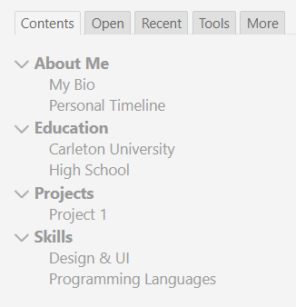
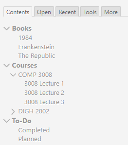

# 🧠 TiddlyWiki Templates – Personal Wiki Starter Kits

Welcome! This repo includes two ready-to-use **TiddlyWiki templates** for building your own mini personal Wikipedia. TiddlyWiki is a single-file, open-source wiki system that runs entirely in your browser or in a lightweight app. These templates help you organize your thoughts, projects, and studies using tags, links, and a sidebar.

---

## 📄 Included Templates

### `myWiki.html`  
A bright, clean layout with a focus on **personal profile structure** — like a mini Wikipedia about you.

**Sections:**
- About Me → My Bio, Personal Timeline  
- Education → Carleton University, High School  
- Projects → Project 1  
- Skills → Design & UI, Programming Languages



---

### `OrganizingWiki.html`  
A dark theme focused on **academic structure** — ideal for students or course planning.

**Sections:**
- Books → 1984, Frankenstein, The Republic  
- Courses → COMP 3008 & DIGH 2002 (with 3 lectures each)  
- To-Do → Completed, Planned



---

## 🚀 How to Use

1. **Download or clone** this repository  
   (Click the green **Code** button → Download ZIP)

2. Open any `.html` file in your **browser** or in **TiddlyDesktop**

3. Start editing directly — everything is saved inside the file itself

---

## 📂 Optional: Add a Sidebar “Contents” Tab

Want to list your wiki sections in the sidebar like in the templates? Here’s how:

### ✅ Steps to Create the "Contents" Tab

1. Click the **plus (+)** icon in the sidebar to create a new tiddler  
2. Title it:  
   `Contents` *(or whatever you want — this will show in the sidebar)*  
3. Tag it with:  
   `$:/tags/SideBar`  
4. Paste this in the **tiddler body**:
   ```html
   <div class="tc-table-of-contents">
   <<toc-selective-expandable 'Contents' sort[title]>>
   </div>
   ```
5. Add a field:  
   - Field name: `list-before`  
   - Field value: `$:/core/ui/SideBar/Open`  
6. Click the **✓ checkmark** to save

Now, any tiddler tagged with `Contents` will automatically appear in the tab — with expandable sections based on tags.
